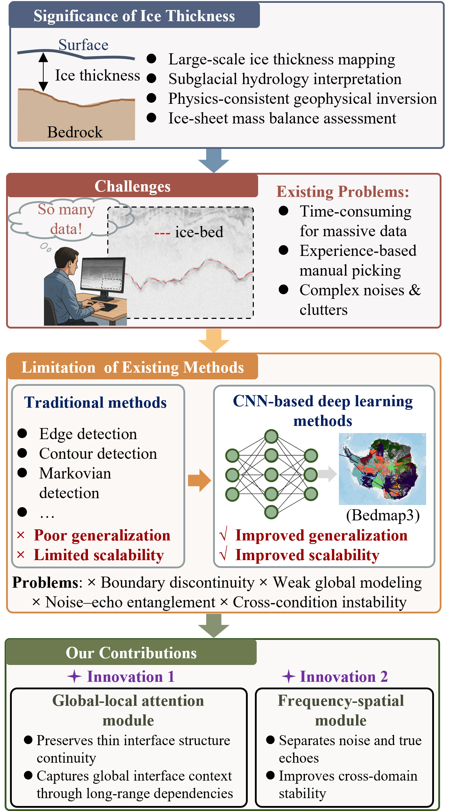

# An Automatic End-to-End Framework for Continuous Ice–Bed Interface Extraction from Ice-Penetrating Radar Data via Frequency–Spatial Deep Learning


# 🧊Core part - PickFormer  
[]()
[]()
[]()
[]()
[]()

</div>

---

## 🌍 Overview

**PickFormer** is a physically informed, end-to-end deep learning framework for automatic and continuous extraction of the **ice–bed interface** from airborne ice-penetrating radar (IPR) data.


## 🧠 Motivation

<div align="center">

</div>

Accurate interface detection is essential for:

- Ice thickness estimation  
- Subglacial geomorphology analysis  
- Antarctic ice-sheet stability assessment  
- Ice-sheet mass balance modeling  

Traditional methods suffer from:

- ❌ Interface discontinuities  
- ❌ Weak bed-return ambiguity  
- ❌ Noise contamination and clutter interference  
- ❌ Limited cross-region generalization  

PickFormer addresses these challenges through a **frequency–spatial transformer architecture**, explicitly integrating spectral discriminative features with spatial structural modeling.

---


**Core Components:**

- 🔹 CNN Backbone Encoder  
- 🔹 G Module (Global Spatial Modeling)  
- 🔹 F Module (Frequency–Spatial Attention)  
- 🔹 Multi-scale Decoder  

---

## 🛰 Dataset

PickFormer is validated on multiple airborne ice-penetrating radar (IPR) datasets from key Antarctic regions:

- **AGAP (Antarctica’s Gamburtsev Province)** – CReSIS Airborne Radar Data (AGAP-GAMBIT 2007–2009)  (Both training, validation, and testing)
  https://data.cresis.ku.edu/data/rds/2009_Antarctica_TO_Gambit/
 
- **Totten Glacier** – AAD / ICECAP (EAGLE) Airborne Radar Data  (Only testing)
  https://data.aad.gov.au/metadata/AAS_4346_EAGLE_ICECAP_LEVEL0_RAW_DATA

- **Pine Island Glacier** – CReSIS Airborne Radar Data (2011 Antarctica DC-8 Campaign)  (Only testing)
  https://data.cresis.ku.edu/data/rds/2011_Antarctica_DC8/

- **Antarctic Peninsula** – CReSIS Airborne Radar Data (2009 Antarctica DC-8 Campaign)  (Only testing)
  https://data.cresis.ku.edu/data/rds/2009_Antarctica_DC8/

> For access and download, please explore the listed directories under the corresponding radar data product folders.  
> When downloading or citing the datasets, please comply with the data usage policies and copyright statements of the respective data providers.

After downloading the datasets, please convert the .mat files into .npy format before using them for training or inference.
Run the following script to convert the downloaded `.mat` radar files into `.npy` format:

```bash
python Convert_npy.py
```

## 📁 Project Structure

├── convert_npy.py        # Convert raw radar .mat files to .npy format  
├── PickFormer_v2.py      # PickFormer model definition  
├── train.py              # Training script  
├── test.py               # Inference / evaluation script  
├── util_new.py           # Utility functions (data processing, metrics, etc.)  
├── requirements.txt      # Required Python dependencies  


## 🚀 Installation

```bash
git clone https://github.com/vivian-ma97/PickFormer.git
cd PickFormer

conda create -n pickformer python=3.11
conda activate pickformer

pip install -r requirements.txt
```

## 🏋️ Training

```bash
python train.py 
```

## 🔍 Inference

```bash
python test.py 
```

## 📦 Pretrained Weights

Download:

```
url: https://pan.baidu.com/s/1sp73qZ4mwl2ok7IERYDLFg?pwd=dyct answer: dyct 
```

## 🔁 Reproducibility

If you encounter any issues when running the code, please feel free to contact me (qianma@tongji.edu.cn). I would be happy to provide remote assistance if needed.


## 📜 License

The current version of the code is released for research and review purposes only.

The associated manuscript is currently under peer review.  
The implementation may be updated and refined following the review process.

Upon official acceptance of the manuscript, the final and complete version of the code will be publicly released under the MIT License.
